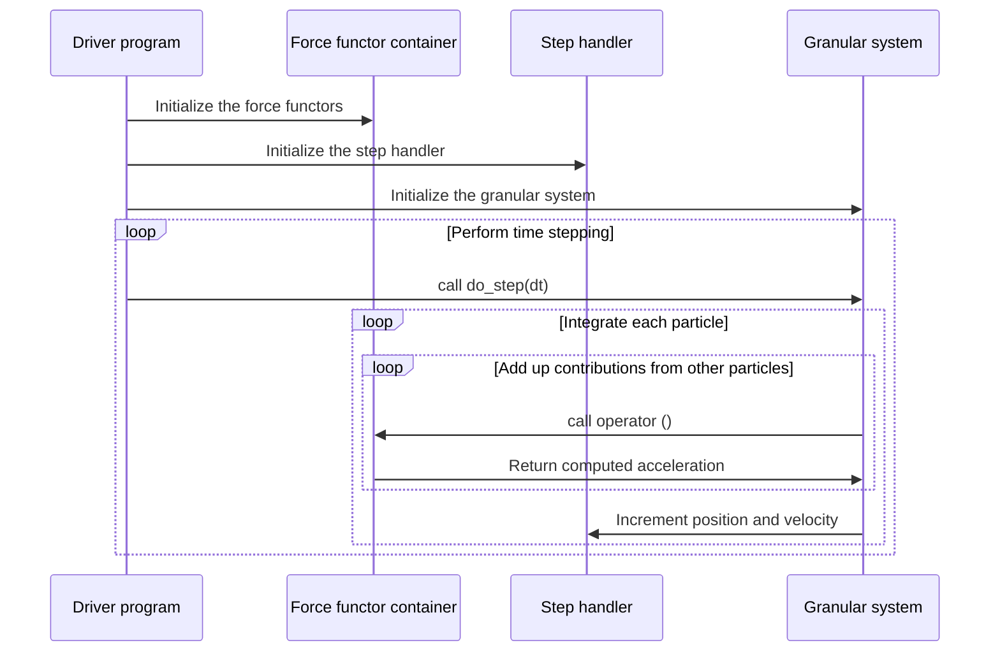

# libgran 

libgran is a Discrete Element Method (DEM) framework for simulating the mechanical behavior of soot aggregates. DEM is a
technique for simulation of granular media consisting of rigid spherical particles. The resultant force and torque acting
on each particle are computed and used with Newton's second law to compute the motion of particles:
```math
m\ddot{\mathbf{x}}=\mathbf{f}
```
```math
I\ddot{\boldsymbol{\omega}}=\boldsymbol{\tau}
```
The forces that particles experience arise from friction at inter-particle contacts, bonding between particles, 
inter-particle attraction, field forces, etc. libgran contains a bonded and a non-bonded contact model, a Van der Waals
attraction model and is designed to be easily extensible with custom models. A simulation is set up in the driver program, which needs to initialize three components:
- Force functor container
- Step handler
- Granular system

### Force functor container

A force functor container is an object that contains instances of all force models that are used in the simulation.
The choice of which force models to use is made statically and the list of force models is provided in template arguments
to the force functor container. It is a good practice to create aliases to the force models and the force container types
that will be used in the simulation at the start of the driver program to improve code readability later on. For example,
the code snippet below creates an alias to a force functor container with a frictional contact force model and Van der Waals
attraction force model called `binary_force_container_t`:
```c++
#include <Eigen/Eigen>

#include <libgran/contact_force/contact_force.h>
#include <libgran/hamaker_force/hamaker_force.h>
#include <libgran/granular_system/granular_system.h>

using contact_force_functor_t = contact_force_functor<Eigen::Vector3d, double>; // Contact force
using vdw_force_dunctor_t = hamaker_functor<Eigen::Vector3d, double>; // Van der Waals force
using binary_force_container_t = binary_force_functor_container<Eigen::Vector3d, double, contact_force_functor_t, vdw_force_dunctor_t>; // Binary force container
```
Then, in the driver program, each force model and the force functor container need to be instantiated:
```c++
int main() {
    
    /* Declare the constants ... */
    
    // Create an instance of contact force model
    contact_force_functor_t contact_force_model(x0.size(),
        k, gamma_n, k, gamma_t, mu, phi, k, gamma_r, mu_o, phi, k, gamma_o,
        mu_o, phi, r_part, mass, inertia, dt, Eigen::Vector3d::Zero(), 0.0);

    // Create an instance of Van der Waals attraction model
    vdw_force_dunctor_t hamaker_model(A, h0,
        r_part, mass, Eigen::Vector3d::Zero(), 0.0);

    binary_force_container_t
            binary_force_functors{contact_force_model, hamaker_model};
    
    /* Do other simulation stuff ... */
    
    return 0;
}
```
`binary_force_container_t` is an alias to `binary_force_functor_container` - an object meant to contain force models that describe
binary interactions between particles. It is also possible to define unary force models for forces that affect each particle
independently. Examples of such forces could be gravity or an electric field. If we do not want to use any unary forces in the
simulation, we will need to create an en empty placeholder unary force container:
```c++
/* ... */
using unary_force_container_t = unary_force_functor_container<Eigen::Vector3d, double>; // Unary force container (empty)

int main () {
    
    /* ... */

    unary_force_container_t unary_force_functors;
    
    /* ... */
    
    return 0;
}
```
### Step handler
A step handler is an object that provides a layer of abstraction between the integrator that computes the position and velocity
increments, and the representation of positions / velocities of individual particles. A trivial step handler simply takes 
position or velocity increments as arguments and increments the position and velocity of the specified particle. But in some
simulations this default behavior needs to be overriden or additional manipulations need to be performed with position / velocity
increments computed for a particle. In those scenarios, it is convenient to define a step handler. For example, if we want to keep
one particle in the simulation fixed in space, we can define a step handler that never increments velocity of that particle.

The default step handler that simply increments positions and velocities is provided by the implementation and can be created
in the following manner:
```c++
int main() {
    
    /* ... */
    
    rotational_step_handler<std::vector<Eigen::Vector3d>, Eigen::Vector3d> step_handler_instance;
    
    /* ... */
    
    return 0;
}
```
### Granular system
A granular system is an object that contains positions and velocities of the particles and encapsulates the integrator.
It makes calls to the force functor container when it needs accelerations computed and to the step handler when it needs
positions incremented. Initial positions and velocities of the particles need to be provided to the granular system constructor.
Granular system contains a method, `do_step(dt)`, that should be called by the driver program to advance the system by
time step dt. Example of usage of granular system:
```c++
/* ... */

using granular_system_t = granular_system<Eigen::Vector3d, double, rotational_velocity_verlet_half,
    rotational_step_handler, binary_force_container_t, unary_force_container_t>; // Granular system representation
    
int main() {
    
    /* ... */

    // Initialize two particles
    std::vector<Eigen::Vector3d> x0, v0, theta0, omega0;
    x0.emplace_back(0.0, 0.0, 0.0);
    x0.emplace_back(0.0, 2.5*r_part, 0.0);
    
    // Initialize the remaining buffers
    v0.resize(x0.size());
    theta0.resize(x0.size());
    omega0.resize(x0.size());
`   std::fill(v0.begin(), v0.end(), Eigen::Vector3d::Zero());
    std::fill(theta0.begin(), theta0.end(), Eigen::Vector3d::Zero());
    std::fill(omega0.begin(), omega0.end(), Eigen::Vector3d::Zero());

    // Buffers with initial positions anv velocities are copied into the binary system object
    // and can be safely deleted after initialization of granular system
    // Step handler and force functor containers are stored in the granular system as references
    // and need to exist for the duration of use of the granular system object
    granular_system_t system(x0,
        v0, theta0, omega0, 0.0, Eigen::Vector3d::Zero(),
        0.0, step_handler_instance, binary_force_functors, unary_force_functors);

    /* ... */
    
    return 0;
}
```
Now that the granular system is initialized, all that's left is to perform the time stepping, output data periodically,
and post-process the results as necessary:
```c++
/* ... */

int main() {

    /* ... */

    for (size_t n = 0; n < n_steps; n ++) {
        if (n % dump_period == 0) {
            /* Perform a data dump */
        }
        system.do_step(dt); // Advance the system
    }
    
    /* Post-process the data */
    
    return 0;
}
```
### libgran work flow
The work flow involved in a simulation and the relationships between components are presented in the diagram below:

## Included force models

The force models that are provided by the implementation are described in this section.

### Contact force

The contact model is based on constraining the four degrees of freedom of motion of two particles relative to each other:
normal translation, tangential translation, torsion, and rolling. Let us consider two particles i and j. We can begin by 
defining a unit normal vector:
```math
\mathbf{n}=\frac{\mathbf{x}_{j}-\mathbf{x}_{i}}{\lVert\mathbf{x}_{j}-\mathbf{x}_{i}\rVert}
```
The relative velocity at the point of contact is:
```math
\mathbf{v}_{ij}=\mathbf{v}_j-\mathbf{v}_i+\boldsymbol{\omega}_{j}\times a\mathbf{n}+\boldsymbol{\omega}_{i}\times a\mathbf{n}
```
where $a$ is particle radius corrected for inter-particle overlap/separation, $\mathbf{v}$ is particle translational velocity, and
$\boldsymbol{\omega}$ is particle angular velocity. Relative velocity can be decomposed into normal and residual (tangential) components:
```math
\mathbf{v}_{ij,\rm n}=\left(\mathbf{v}_{ij}\cdot \mathbf{n}\right)\mathbf{n}
```
```math
\mathbf{v}_{ij,\rm t}=\mathbf{v}_{ij}-\mathbf{v}_{ij,\rm n}
```
Similarly, relative angular velocity:
```math
\boldsymbol{\omega}_{ij}=\boldsymbol{\omega}_j-\boldsymbol{\omega}_i
```
can be decomposed into normal (torsional) and residual (rolling) components:
```math
\boldsymbol{\omega}_{ij,\rm o}=\left(\boldsymbol{\omega}_{ij}\cdot\mathbf{n}\right)\mathbf{n}
```
```math
\boldsymbol{\omega}_{ij,\rm r}=\boldsymbol{\omega}_{ij}-\boldsymbol{\omega}_{ij,\rm o}
```
To constrain the four degrees of freedom, we insert four springs, as illustrated in the figure below: 


The length of the normal spring, $\delta$, can be computed directly at any point in the simulation from positions of the particles,
$\mathbf{x}$, and their radius, $r$:
```math
\delta=\lVert\mathbf{x}_j-\mathbf{x}_i\rVert-2r
```
The remaining three springs have zero length at the time the contact is formed and have their lengths accumulated
throughout the duration of the contact. Let a spring vector be $\boldsymbol\xi$. Then the rate of stretching /
contraction of a spring, $\dot{\boldsymbol\xi}$, is given by:
```math
\dot{\boldsymbol\xi}_{\rm t}=\mathbf{v}_{ij,\rm t}
```
```math
\dot{\boldsymbol\xi}_{\rm o}=r\boldsymbol{\omega}_{ij,\rm o}
```
```math
\dot{\boldsymbol\xi}_{\rm r}=\boldsymbol{\omega}_{ij,\rm r}\times a\mathbf{n}
```
Then, as long as the contact lasts, spring $\boldsymbol{\xi}$ is incremented at each time step to
obtain a new spring, $\boldsymbol{\xi}'$, to be used at the next time step:
```math
\boldsymbol{\xi}'=\boldsymbol{\xi}+\dot{\boldsymbol{\xi}}\Delta t
```

#### Bonded contact force

For a pair of particles that is connected with a rigid bond, we would like to approximate a rigid--body motion.
In other words, the common reference frame of particles i and j can rotate and translate, but any translation or
rotation of particle i relative to particle j should be restricted. The distance between all points in the pair of
particles should be approximately preserved over time. It can be shown that when using the springs defined in the
[contact force section](#contact-force) to restrict the motion of particles i and j, then the union of particles i and j will undergo
rigid body motion as the stiffness of inserted springs approaches infinity. In the simulation we need to use a finite
stiffness value, but as long as the amplitude of oscillations is much smaller than the length scale of particles in the
simulation, the motion will, approximately, be rigid.

To stabilize the system over time and dissipate any vibrational kinetic energy in the bonds, each spring is supplemented by a
dashpot element. The force, $\mathbf{f}$, exerted on particle i by each spring in the i-j bond is given by:
```math
\mathbf{f}=k\boldsymbol{\xi}+\gamma\dot{\boldsymbol{\xi}}
```
where $k$ is stiffness and $\gamma$ is the damping coefficient of the respective spring.
And forces exerted on particle j are equal in magnitude and opposite in direction.
Forces arising from the normal and tangential springs are applied to the particles.
The force associated with the tangential spring will also give rise to torques because the tangential force is not
collinear with $\mathbf{n}$. Forces computed from the torsion and rolling resistance springs are quasi-forces
that are not applied to particles i and j, but are only used to compute torques that will be applied to the particles.

#### Frictional contact force

The model described in [Luding 2008](https://doi.org/10.1007/s10035-008-0099-x) is used to simulate
frictional contacts between non-bonded particles. A brief description
is provided here and the reader is referred to [Luding 2008](https://doi.org/10.1007/s10035-008-0099-x)
for a more detailed description. Luding's model uses the same four springs described
in an earlier section to compute normal and tangential forces, rolling
and torsion resistance torques. Instead of directly setting force proportional
to spring elongation, a certain degree of slip is allowed between particles in contact.
That is done by computing a test force, $\mathbf{f}_{0}$:
```math
\mathbf{f}_{0}=k\boldsymbol{\xi}+\gamma\dot{\boldsymbol{\xi}}
```
and deciding whether static or dynamic friction should be used based on Coulomb's law of friction:
```math
f_{C,s}=\mu_s f_{\rm n}
```
```math
f_{C,d}=\mu_d f_{\rm n}
```
where $\mu_s$ is the static friction coefficient, $\mu_d$ is the dynamic friction coefficient,
and $f_n$ is the magnitude of the normal force between the two particles.
Then a choice is made whether static or dynamic friction should be used based
on the following condition:
```math
\text{if}\ \lVert\mathbf{f}_0\rVert\leq f_{C,s}\ \text{use static friction}
```
```math
\text{if}\ \lVert\mathbf{f}_0\rVert> f_{C,s}\ \text{use dynamic friction}
```

In case the contact is determined to be in the state of static friction,
the tangential spring $\boldsymbol\upxi$ is incremented as described in
[contact force section](#contact-force) and the test force is used to compute torques and,
in the case of the tangential force, is also applied to the contacting particles.
In case the contact is determined to be in the state of dynamic friction,
the spring is not allowed to stretch anymore. Instead, a certain extent of slipping is allowed.
The spring to be used at the next iteration, $\boldsymbol\upxi'$, is set to
```math
\boldsymbol\upxi'=-\frac{1}{k}\left(f_{C,d}\frac{\mathbf{f}_0}{\lVert \mathbf{f}_0\rVert}+\gamma\dot{\boldsymbol\upxi}\right)
```
and the magnitude of the Coulomb's force, $f_{C,d}$, is used to compute torques and, if applicable, accelerate the particles in contact.

The model is only enabled when the normal force is repulsive. 
Once particles are not overlapping, the frictional force is set
to zero and accumulated springs are reset.

### Van der Waals attraction force

[Hamaker 1937](https://doi.org/10.1016/S0031-8914(37)80203-7) derived the potential energy, $U$, due
to Van der Waals attraction between two particles of radius $r$ whose surfaces are separated by distance
$\delta$ from each other to be:
```math
U=-\frac{A}{6}\left[\frac{2r^2}{(4r+\delta)\delta}+\frac{2r^2}{(2r+\delta)^2}+\ln\frac{(4r+\delta)\delta}{(2r+\delta)^2}\right]
```
where $A$ is the Hamaker constant - a material property. The magnitude of force acting on the particles can be derived by
differentiating potential energy, $U$, with respect to separation distance, $\delta$, and the direction of the force will
coincide with the normal unit vector $\bf n$ defined earlier:
```math
\mathbf{f}=-\frac{A}{6}\left[\frac{(4r+2\delta)}{(4r+\delta)\delta}-\frac{2}{(2r+\delta)}-\frac{4r^2}{(2r+\delta)^3}-\frac{2r^2(4r+2\delta)}{(4r+\delta)^2\delta^2}\right]\mathbf{n}
```
Since in the limit as $\delta$ approaches $0$ the magnitude of force (and potential energy) becomes infinite,
a saturation distance $\delta_0$ is introduced. Attractive force does not increase past the saturation distance. The magnitude of $\delta_0$ varies between 0.4 and 1 nm ([Ranade 1987](
https://doi.org/10.1080/02786828708959155)).

## Implementing custom binary force models

## Implementing custom unary force models

## Implementing custom step handlers

## Simulation example

## Class reference

## Installation

If your project is a git repository, libgran can be added to it as a git submodule. For example, to install libgran and
its dependency libtimestep in a directory named deps under your project root, run:
```shell
git submodule add deps/libgran https://github.com/egor-demidov/libgran
git submodule add deps/libtimestep https://github.com/egor-demidov/libtimestep
```
Since libgran and libtimestep are header-only libraries, they can be included in your project without linking against
an object. Simply, add the include directories of libgran and libtimestep in your CMakeLists.txt file:
```cmake
include_directories(deps/libgran/include)
include_directories(deps/libtimestep/include)
```
By default, libgran uses C++ 17 parallel algorithms for computation of binary interactions. In case you would like to
use OpenMP instead, `LIBGRAN_USE_OMP` compile definition needs to be added. In your CMakeLists.txt, add the following
line:
```cmake
add_compile_definitions(LIBGRAN_USE_OMP)
```
Note that for improved performance / parallelization capabilities, additional compiler flags might be required on your
system. Platform- and toolchain-specific instructions are provided below. Also, the optimal number of threads depends on
the size of the granular system. Using too many threads can be detrimental to performance.

### Linux & GNU C++ compiler

The following compiler flags are recommended for best performance:
```
-O3 -flto=auto -march=native
```

#### Parallelization with C++ 17 algorithms

If you opted for C++ 17 parallel algorithms (default), Intel TBB library needs to be installed and linked against.
On Ubuntu, TBB can be installed with:
```shell
sudo apt install libtbb2-dev
```
Then, in your CMakeLists.txt file, add:
```cmake
find_package(TBB REQUIRED)

# Set up your targets...

target_link_libraries(<your target name> PRIVATE TBB::tbb)
```

#### Parallelization with OpenMP

If you opted for OpenMP, the following flag needs to be added:
```
-fopenmp
```
Then, every time you run your simulation, the number of threads can be set prior to execution with:
```shell
export OMP_NUM_THREADS=4
```
