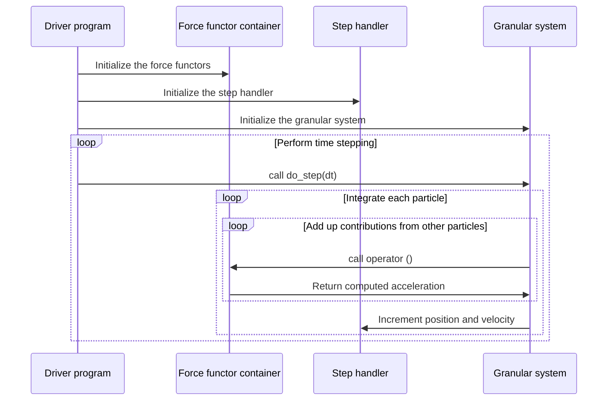

# libgran

libgran is a Discrete Element Method (DEM) framework for simulating the mechanical behavior of soot aggregates.
libgran contains a bonded and a non-bonded contact model, a Van der Waals attraction model and is extensible with custom
models.

