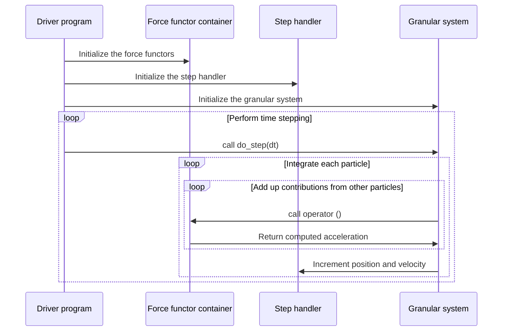

# libgran 

libgran is a Discrete Element Method (DEM) framework for simulating the mechanical behavior of soot aggregates. DEM is a
technique for simulation of granular media consisting of rigid spherical particles. The resultant force and torque acting
on each particle are computed and used with Newton's second law to compute the motion of particles:
```math
m\ddot{\mathbf{x}}=\mathbf{f}
```
```math
I\ddot{\boldsymbol{\omega}}=\boldsymbol{\tau}
```
The forces that particles experience arise from friction at inter-particle contacts, bonding between particles, 
inter-particle attraction, field forces, etc. libgran contains a bonded and a non-bonded contact model, a Van der Waals
attraction model and is designed to be easily extensible with custom models. A simulation is set up in the driver program, which needs to initialize three components:
- Force functor container
- Step handler
- Granular system

### Force functor container

A force functor container is an object that contains instances of all force models that are used in the simulation.
The choice of which force models to use is made statically and the list of force models is provided in template arguments
to the force functor container. It is a good practice to create aliases to the force models and the force container types
that will be used in the simulation at the start of the driver program to improve code readability later on. For example,
the code snippet below creates an alias to a force functor container with a frictional contact force model and Van der Waals
attraction force model called `binary_force_container_t`:
```c++
#include <Eigen/Eigen>

#include <libgran/contact_force/contact_force.h>
#include <libgran/hamaker_force/hamaker_force.h>
#include <libgran/granular_system/granular_system.h>

using contact_force_functor_t = contact_force_functor<Eigen::Vector3d, double>; // Contact force
using vdw_force_dunctor_t = hamaker_functor<Eigen::Vector3d, double>; // Van der Waals force
using binary_force_container_t = binary_force_functor_container<Eigen::Vector3d, double, contact_force_functor_t, vdw_force_dunctor_t>; // Binary force container
```
Then, in the driver program, each force model and the force functor container need to be instantiated:
```c++
int main() {
    
    /* Declare the constants ... */
    
    // Create an instance of contact force model
    contact_force_functor_t contact_force_model(x0.size(),
        k, gamma_n, k, gamma_t, mu, phi, k, gamma_r, mu_o, phi, k, gamma_o,
        mu_o, phi, r_part, mass, inertia, dt, Eigen::Vector3d::Zero(), 0.0);

    // Create an instance of Van der Waals attraction model
    vdw_force_dunctor_t hamaker_model(A, h0,
        r_part, mass, Eigen::Vector3d::Zero(), 0.0);

    binary_force_container_t
            binary_force_functors{contact_force_model, hamaker_model};
    
    /* Do other simulation stuff ... */
    
    return 0;
}
```
`binary_force_container_t` is an alias to `binary_force_functor_container` - an object meant to contain force models that describe
binary interactions between particles. It is also possible to define unary force models for forces that affect each particle
independently. Examples of such forces could be gravity or an electric field. If we do not want to use any unary forces in the
simulation, we will need to create an en empty placeholder unary force container:
```c++
/* ... */
using unary_force_container_t = unary_force_functor_container<Eigen::Vector3d, double>; // Unary force container (empty)

int main () {
    
    /* ... */

    unary_force_container_t unary_force_functors;
    
    /* ... */
    
    return 0;
}
```
### Step handler
A step handler is an object that provides a layer of abstraction between the integrator that computes the position and velocity
increments, and the representation of positions / velocities of individual particles. A trivial step handler simply takes 
position or velocity increments as arguments and increments the position and velocity of the specified particle. But in some
simulations this default behavior needs to be overriden or additional manipulations need to be performed with position / velocity
increments computed for a particle. In those scenarios, it is convenient to define a step handler. For example, if we want to keep
one particle in the simulation fixed in space, we can define a step handler that never increments velocity of that particle.

The default step handler that simply increments positions and velocities is provided by the implementation and can be created
in the following manner:
```c++
int main() {
    
    /* ... */
    
    rotational_step_handler<std::vector<Eigen::Vector3d>, Eigen::Vector3d> step_handler_instance;
    
    /* ... */
    
    return 0;
}
```
### Granular system
A granular system is an object that contains positions and velocities of the particles and encapsulates the integrator.
It makes calls to the force functor container when it needs accelerations computed and to the step handler when it needs
positions incremented. Initial positions and velocities of the particles need to be provided to the granular system constructor.
Granular system contains a method, `do_step(dt)`, that should be called by the driver program to advance the system by
time step dt. Example of usage of granular system:
```c++
/* ... */

using granular_system_t = granular_system<Eigen::Vector3d, double, rotational_velocity_verlet_half,
    rotational_step_handler, binary_force_container_t, unary_force_container_t>; // Granular system representation
    
int main() {
    
    /* ... */

    // Initialize two particles
    std::vector<Eigen::Vector3d> x0, v0, theta0, omega0;
    x0.emplace_back(0.0, 0.0, 0.0);
    x0.emplace_back(0.0, 2.5*r_part, 0.0);
    
    // Initialize the remaining buffers
    v0.resize(x0.size());
    theta0.resize(x0.size());
    omega0.resize(x0.size());
`   std::fill(v0.begin(), v0.end(), Eigen::Vector3d::Zero());
    std::fill(theta0.begin(), theta0.end(), Eigen::Vector3d::Zero());
    std::fill(omega0.begin(), omega0.end(), Eigen::Vector3d::Zero());

    // Buffers with initial positions anv velocities are copied into the binary system object
    // and can be safely deleted after initialization of granular system
    // Step handler and force functor containers are stored in the granular system as references
    // and need to exist for the duration of use of the granular system object
    granular_system_t system(x0,
        v0, theta0, omega0, 0.0, Eigen::Vector3d::Zero(),
        0.0, step_handler_instance, binary_force_functors, unary_force_functors);

    /* ... */
    
    return 0;
}
```
Now that the granular system is initialized, all that's left is to perform the time stepping, output data periodically,
and post-process the results as necessary:
```c++
/* ... */

int main() {

    /* ... */

    for (size_t n = 0; n < n_steps; n ++) {
        if (n % dump_period == 0) {
            /* Perform a data dump */
        }
        system.do_step(dt); // Advance the system
    }
    
    /* Post-process the data */
    
    return 0;
}
```
### libgran work flow
The work flow involved in a simulation and the relationships between components are presented in the diagram below:

## Included force models

The force models that are provided by the implementation are described in this section.

### Contact force

The contact model is based on constraining the four degrees of freedom of motion of two particles relative to each other:
normal translation, tangential translation, torsion, and rolling. Let us consider two particles i and j. We can begin by 
defining a unit normal vector:
```math
\mathbf{n}=\frac{\mathbf{x}_{j}-\mathbf{x}_{i}}{\lVert\mathbf{x}_{j}-\mathbf{x}_{i}\rVert}
```
The relative velocity at the point of contact is:
```math
\mathbf{v}_{ij}=\mathbf{v}_j-\mathbf{v}_i+\boldsymbol{\omega}_{j}\times a\mathbf{n}+\boldsymbol{\omega}_{i}\times a\mathbf{n}
```
where $a$ is particle radius corrected for inter-particle overlap/separation, $\mathbf{v}$ is particle translational velocity, and
$\boldsymbol{\omega}$ is particle angular velocity. Relative velocity can be decomposed into normal and residual (tangential) components:
```math
\mathbf{v}_{ij,\rm n}=\left(\mathbf{v}_{ij}\cdot \mathbf{n}\right)\mathbf{n}
```
```math
\mathbf{v}_{ij,\rm t}=\mathbf{v}_{ij}-\mathbf{v}_{ij,\rm n}
```
Similarly, relative angular velocity:
```math
\boldsymbol{\omega}_{ij}=\boldsymbol{\omega}_j-\boldsymbol{\omega}_i
```
can be decomposed into normal (torsional) and residual (rolling) components:
```math
\boldsymbol{\omega}_{ij,\rm o}=\left(\boldsymbol{\omega}_{ij}\cdot\mathbf{n}\right)\mathbf{n}
```
```math
\boldsymbol{\omega}_{ij,\rm r}=\boldsymbol{\omega}_{ij}-\boldsymbol{\omega}_{ij,\rm o}
```
To constrain the four degrees of freedom, we insert four springs, as illustrated in the figure below: 


The length of the normal spring, $\delta$, can be computed directly at any point in the simulation from positions of the particles,
$\mathbf{x}$, and their radius, $r$:
```math
\delta=\lVert\mathbf{x}_j-\mathbf{x}_i\rVert-2r
```
The remaining three springs have zero length at the time the contact is formed and have their lengths accumulated
throughout the duration of the contact. Let a spring vector be $\boldsymbol\xi$. Then the rate of stretching /
contraction of a spring, $\dot{\boldsymbol\xi}$, is given by:
```math
\dot{\boldsymbol\xi}_{\rm t}=\mathbf{v}_{ij,\rm t}
```
```math
\dot{\boldsymbol\xi}_{\rm o}=r\boldsymbol{\omega}_{ij,\rm o}
```
```math
\dot{\boldsymbol\xi}_{\rm r}=\boldsymbol{\omega}_{ij,\rm r}\times a\mathbf{n}
```
Then, as long as the contact lasts, spring $\boldsymbol{\xi}$ is incremented at each time step to
obtain a new spring, $\boldsymbol{\xi}'$, to be used at the next time step:
```math
\boldsymbol{\xi}'=\boldsymbol{\xi}+\dot{\boldsymbol{\xi}}\Delta t
```
#### Frictional contact force


#### Bonded contact force

### Van der Waals attraction force

## Implementing custom binary force models

## Implementing custom unary force models

## Implementing custom step handlers

## Simulation example

## Class reference
