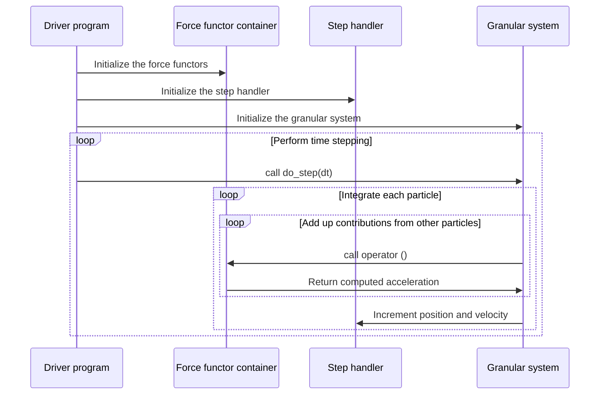

# Overview

libgran is a C++ template library for Discrete Element Method (DEM) simulations. It
targets static modularity - an approach where different modules involved in a simulation,
like the integrator and the inter-particle force models, are **assembled at compile time**.
These semantics are achieved through the extensive use of templates. The main advantage of
static modularity is that the compiler has more information about the simulation that is
going to be run, thus allowing it to optimize generated code more radically.

Libgran has several built-in force models, such as [Van der Waals attraction](Van-der-Waals-attraction.md)
and [contact friction force](Frictional-contact.md)
and is designed to be easily [extensible with custom models](Custom-binary-force-model.md).

## libgran architecture

Each libgran simulation is initialized and driven by a program that specializes and
creates instances of libgran's templates. In particular, the driver program has to initialize
three components:

- Force model containers - [binary](Binary-force-container.md) and [unary](Unary-force-container.md)
- Step handler
- [Granular system](Granular-system.md)

A typical simulation workflow involving these components is illustrated in the diagram below:

<seealso>
<category ref="related">
    <a href="Installation.md">Installation</a>
    <a href="Tutorials.md">Tutorials</a>
    <a href="Class-reference.md">Class reference</a>
</category>
<category ref="external">
    <a href="https://github.com/egor-demidov/libgran">libgran on GitHub</a>
    <a href="https://github.com/egor-demidov/libtimestep">libtimestep on GitHub</a>
</category>
</seealso>